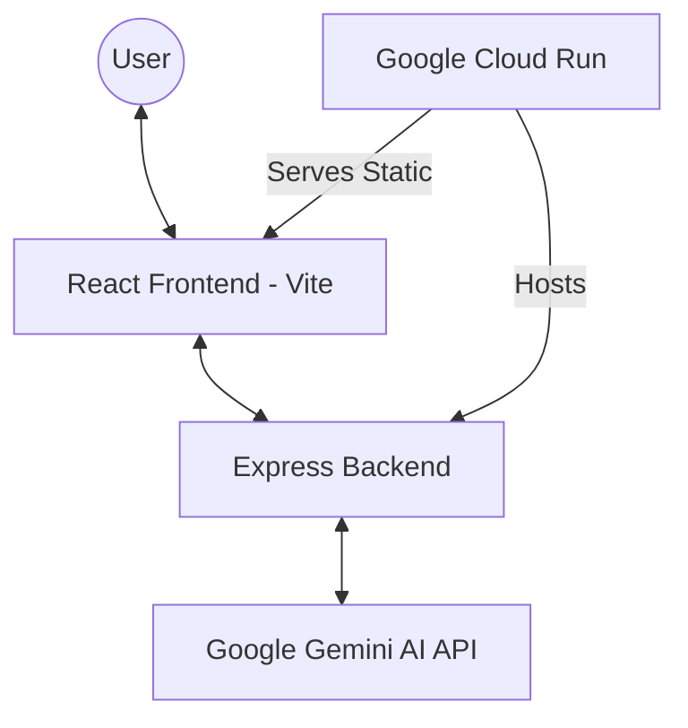
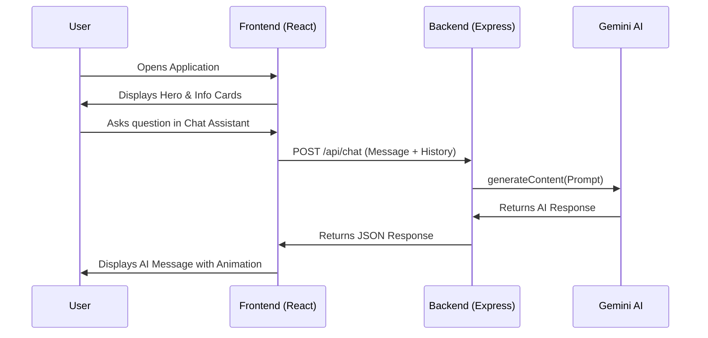

# 🗳️ ElectorAI: Election Process Assistant

ElectorAI is a modern, interactive web application designed to educate citizens about the complexities of election processes. By combining a sleek, premium user interface with advanced AI capabilities (Google Gemini), ElectorAI provides a conversational and gamified learning experience for understanding both **Indian** and **United States** election systems.

## 🌟 Key Features

- **🤖 AI Assistant**: A real-time conversational agent powered by Gemini 2.5 Flash that answers complex questions about voter registration, polling procedures, and constitutional rules.
- **🃏 Educational Flashcards**: Interactive cards covering key concepts like the "7-Phase Journey" in India and the "Electoral College" in the USA.
- **📝 Interactive Quiz**: A gamified testing module to help users verify their knowledge of democratic processes.
- **🎨 Premium UI/UX**: Built with a "dark mode" aesthetic, glassmorphism effects, and smooth Framer Motion animations.
- **🚀 Cloud Native**: Fully containerized with Docker and deployed on Google Cloud Run for global scalability.

## 🛠️ Technology Stack

- **Frontend**: React 19, Vite, Framer Motion, Lucide Icons, Vanilla CSS
- **Backend**: Node.js, Express.js
- **AI Engine**: Google Generative AI (Gemini 2.5 Flash)
- **Deployment**: Docker, Google Cloud Run, Artifact Registry

## 📊 System Architecture



## 🗺️ User Journey



## 🚀 Getting Started

### Prerequisites
- Node.js 20+
- Google Gemini API Key

### Local Setup
1. Clone the repository:
   ```bash
   git clone https://github.com/Lahari-1402/ElectorAI.git
   ```
2. Install dependencies:
   ```bash
   npm install
   ```
3. Create a `.env` file in the root:
   ```env
   VITE_GEMINI_API_KEY=your_api_key_here
   ```
4. Start the development server:
   ```bash
   npm run dev
   ```

### Deployment (Cloud Run)
```bash
gcloud run deploy election-app --source . --region us-central1 --allow-unauthenticated
```

## 📜 License
This project is licensed under the MIT License.
